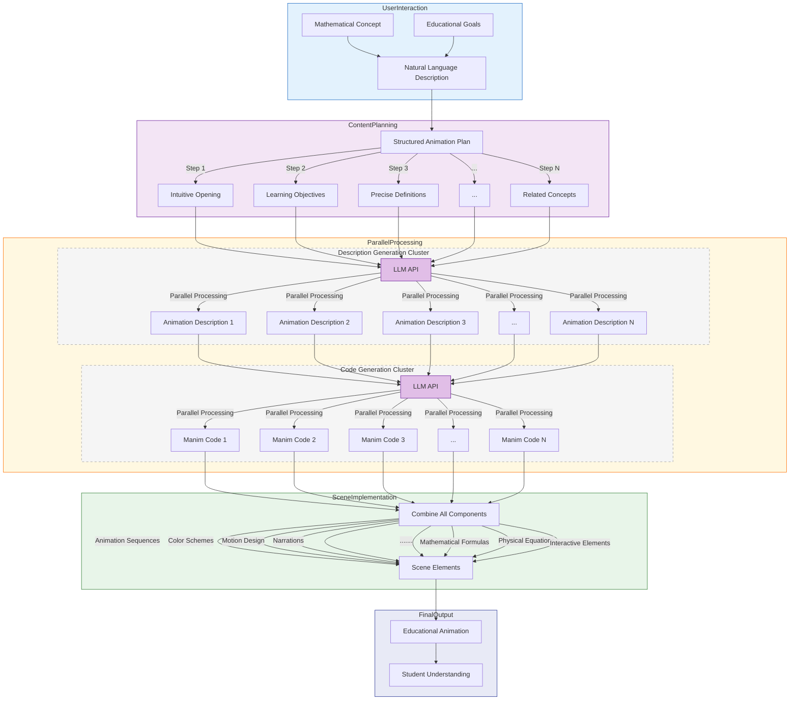

## System Diagrams

### Framework Diagram 

```mermaid
graph TB
    subgraph UserInteraction
        A[Mathematical Concept] --> B[Natural Language Description]
        C[Educational Goals] --> B
    end

    subgraph ContentPlanning
        B --> D[Structured Animation Plan]
        D --> |Step 1| E1[Intuitive Opening]
        D --> |Step 2| E2[Learning Objectives]
        D --> |Step 3| E3[Precise Definitions]
        D --> |...| E4[...]
        D --> |Step N| E5[Related Concepts]
    end

    subgraph ParallelProcessing
        %% Parallel Processing Clusters
        subgraph DescriptionGeneration[Description Generation Cluster]
            direction LR
            E1 & E2 & E3 & E4 & E5 --> LLMD[LLM API]
            LLMD --> |Parallel Processing| AD1 & AD2 & AD3 & AD4 & AD5
        end
        
        subgraph CodeGeneration[Code Generation Cluster]
            direction LR
            AD1[Animation Description 1]
            AD2[Animation Description 2]
            AD3[Animation Description 3]
            AD4[...]
            AD5[Animation Description N]
            AD1 & AD2 & AD3 & AD4 & AD5 -->LLMC[LLM API]
            LLMC -->|Parallel Processing| MC1 & MC2 & MC3 & MC4 & MC5
        end

        MC1[Manim Code 1]
        MC2[Manim Code 2]
        MC3[Manim Code 3]
        MC4[...]
        MC5[Manim Code N]
    end

    subgraph SceneImplementation
        MC1 & MC2 & MC3 & MC4 & MC5 --> M[Combine All Components]
        
        M --> |Animation Sequences| I[Scene Elements]
        M --> |Color Schemes| I
        M --> |Motion Design| I
        M --> |Narrations| I
        M --> |.......| I
        M --> |Mathematical Formulas| I
        M --> |Physical Equations| I
        M --> |Interactive Elements| I
    end

    subgraph FinalOutput
        I --> Q[Educational Animation]
        Q --> R[Student Understanding]
    end

%% Style Definitions
classDef userInteraction fill:#e3f2fd,stroke:#1565c0;
classDef contentPlanning fill:#f3e5f5,stroke:#6a1b9a;
classDef parallelProcessing fill:#fff8e1,stroke:#ff6f00;
classDef sceneImplementation fill:#e8f5e9,stroke:#2e7d32;
classDef finalOutput fill:#e8eaf6,stroke:#283593;
classDef llmAPI fill:#e1bee7,stroke:#6a1b9a;
classDef processingCluster fill:#f5f5f5,stroke:#9e9e9e,stroke-dasharray: 5 5;

%% Apply styles to subgraphs
class UserInteraction userInteraction;
class ContentPlanning contentPlanning;
class ParallelProcessing parallelProcessing;
class SceneImplementation sceneImplementation;
class FinalOutput finalOutput;
class LLMD,LLMC llmAPI;
class DescriptionGeneration,CodeGeneration processingCluster;
``` 