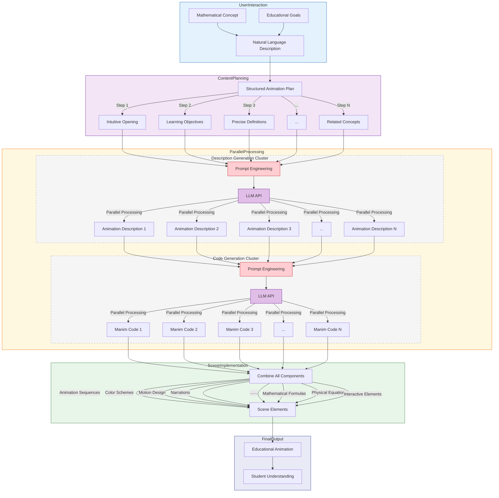

# Animated Math and Physics Visualization System

A powerful system that generates educational animations for mathematical and physics concepts using Manim and AI.

## Features

- 🎯 Generate educational animations from natural language descriptions
- 🤖 AI-powered content generation and code creation
- 🎨 High-quality mathematical animations using Manim
- 🔊 Voiceover support for enhanced learning experience
- 🔄 Parallel processing for efficient generation
- 🧪 Automatic testing and error fixing
- 🌐 Web interface for easy interaction

## Prerequisites

- Python 3.8 or higher
- Node.js 14.0 or higher
- FFmpeg (for video rendering)

## Installation

1. Clone the repository:
```bash
git clone https://github.com/yourusername/Animated-math-and-physics.git
cd Animated-math-and-physics
```

2. Install Python dependencies:
```bash
pip install -r requirements.txt
```

3. Install Manim:
```bash
pip install manim
```

4. Set up environment variables:
Create a `.env` file in the root directory with your API keys:
```
DEEPSEEK_API_KEY=your_deepseek_api_key
GPT4_API_KEY=your_gpt4_api_key
CLAUDE_API_KEY=your_claude_api_key
```

## Configuration

The system's behavior can be customized through `config.py`. Here are the main configuration options:

### LLM API Settings
- `USE_CLAUDE`: Set to `True` to use Claude API (default: `False`)
- `USE_GPT`: Set to `True` to use GPT-4 API (default: `True`)
- `Free_Web`: Free API endpoint URL
- `DeepSeek_Web`: DeepSeek API endpoint URL

### Manim Settings
- `MANIM_CLI_PATH`: Path to the Manim executable
- `MANIM_RENDER_QUALITY`: Rendering quality options: low (l), medium (m), high (h)

### Output Settings
- `OUTPUT_DIR`: Directory for saving output files

### Changing the LLM Model
The system supports multiple LLM models (DeepSeek, GPT-4, and Claude). To change the model:

1. Open `parallel_code_generation.py` and `parallel_processing.py`
2. Update the API configuration at the top of the file:
   ```python
   # For GPT-4:
   gpt_api = GPT4_API_KEY
   # gpt_url = Free_Web 
   
   # For Claude:
   gpt_api = CLAUDE_API_KEY
   gpt_url = "https://api.anthropic.com/v1"
   
   # For DeepSeek (default):
   gpt_api = DeepSeek_Prompt_API_KEY
   gpt_url = DeepSeek_Web
   ```
3. In the `generate_code_for_step`(in`parallel_code_generation.py` ) and `call_llm_api`(in`parallel_processing.py`) function, update the model name:
   ```python
   # For GPT-4:
   model="gpt-4o"  # or "gpt-4-turbo-preview"
   
   # For Claude:
   model="claude-3-opus-20240229"
   
   # For DeepSeek:
   model="deepseek-chat"
   ```

Note: Make sure you have valid API keys for your chosen model in your `.env` file.

To modify these settings:
1. Open `config.py` in your preferred text editor
2. Update the values according to your needs
3. Save the file

## Usage

### Command Line Interface

1. Run the program with a mathematical concept description:
```bash
python main.py "Show the geometric interpretation of the derivative of a function at x=2"
```

2. Or run without arguments to enter the description interactively:
```bash
python main.py
```

### Web Interface(Have not developed yet)

1. Start the Streamlit web interface:
```bash
streamlit run app.py
```

2. Open your browser and navigate to `http://localhost:8501`

3. Enter your mathematical or physics concept description in the text area and click "Generate Visualization"

## Output

The system generates:
- Animation descriptions for each step
- Manim code files
- Rendered video animations
- Process summary with status and details

Output files are saved in:
- `animation_outputs/` - Intermediate files and descriptions
- `final_animation/` - Rendered video files

## Example Usage

Here's an example of how to visualize the material derivative concept:

```bash
python main.py "Show the material derivative of temperature in a fluid flow, including the convective and local derivative components"
```

## License

This project is licensed under the MIT License - see the [LICENSE](LICENSE) file for details.

## Contributing

Contributions are welcome! Please feel free to submit a Pull Request.

## Support

If you encounter any issues or have questions, please open an issue in the GitHub repository.

## System Diagrams


### Framework Diagram 



