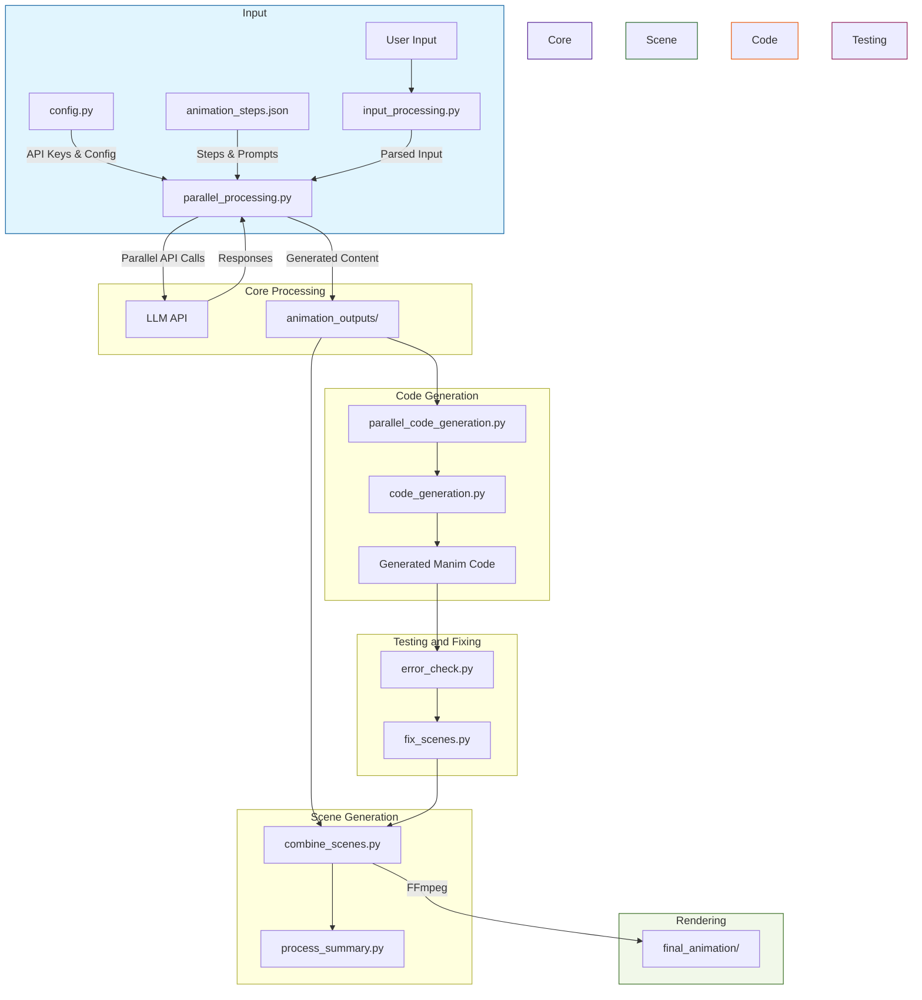

```mermaid
graph TB
    subgraph Input
        A[User Input] --> B[input_processing.py]
        C[config.py] --> |API Keys & Config| D[parallel_processing.py]
        E[animation_steps.json] --> |Steps & Prompts| D
    end

    subgraph Core Processing
        B --> |Parsed Input| D
        D --> |Parallel API Calls| F[LLM API]
        F --> |Responses| D
        D --> |Generated Content| G[animation_outputs/]
    end

    subgraph Scene Generation
        G --> H[combine_scenes.py]
        H --> J[process_summary.py]
    end

    subgraph Code Generation
        G --> K[parallel_code_generation.py]
        K --> L[code_generation.py]
        L --> M[Generated Manim Code]
    end

    subgraph Testing and Fixing
        M --> N[error_check.py]
        N --> I[fix_scenes.py]
        I --> H
    end

    subgraph Rendering
        H --> |FFmpeg| O[final_animation/]
    end

    style Input fill:#e1f5fe,stroke:#01579b
    style Core Processing fill:#f3e5f5,stroke:#4a148c
    style Scene Generation fill:#e8f5e9,stroke:#1b5e20
    style Code Generation fill:#fff3e0,stroke:#e65100
    style Testing and Fixing fill:#fce4ec,stroke:#880e4f
    style Rendering fill:#f1f8e9,stroke:#33691e
``` 