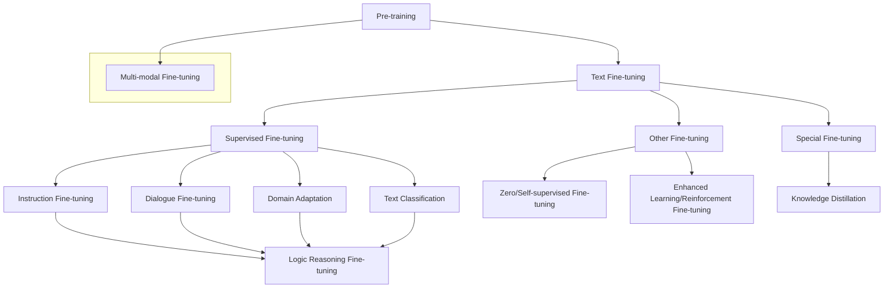

# Fine-tuning Methods

```mermaid
graph TD
    A[Pre-training]
    B[Multi-modal Fine-tuning]
    C[Text Fine-tuning]
    A --> B
    A --> C
    
    C --> D[Supervised Fine-tuning]
    C --> E[Other Fine-tuning]
    C --> F[Special Fine-tuning]
    
    D --> G[Instruction Fine-tuning]
    D --> H[Dialogue Fine-tuning]
    D --> I[Domain Adaptation]
    D --> J[Text Classification]
    
    G --> K[Logic Reasoning Fine-tuning]
    H --> K
    I --> K
    J --> K
    
    E --> L[Zero/Self-supervised Fine-tuning]
    E --> M[Enhanced Learning/Reinforcement Fine-tuning]
    
    F --> N[Knowledge Distillation]
    
    %% Layout control
    subgraph _
    direction LR
    B
    end
```